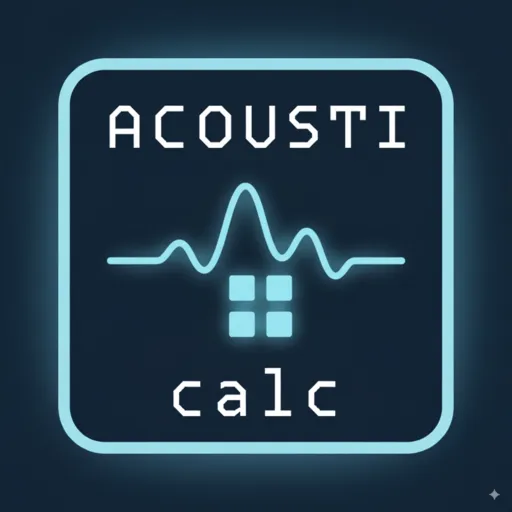

# AcoustiCalc

<div align="center">
  
  
  [](https://goreportcard.com/report/github.com/dmisiuk/acousticalc)
  [](https://opensource.org/licenses/MIT)
  [](https://github.com/dmisiuk/acousticalc/releases)
  [](https://github.com/dmisiuk/acousticalc/actions)
</div>

A revolutionary terminal calculator that bridges the gap between traditional command-line tools and modern graphical interfaces. Built with Go's performance and designed for users who work in terminal environments.

## ✨ Features

### 🧮 Core Calculator Features
- **Basic Arithmetic**: Addition, subtraction, multiplication, division
- **Advanced Operations**: Exponents, roots, percentages, parentheses support
- **Expression Evaluation**: Mathematical expressions with proper operator precedence
- **Error Handling**: Comprehensive error messages and validation
- **High Performance**: <100ms response time, <50MB memory footprint

### 🎯 User Experience
- **Cross-Platform**: Single binary works on Windows, macOS, and Linux
- **No Dependencies**: Standalone application with no external requirements
- **Fast Startup**: <1 second startup time on all platforms
- **CLI Interface**: Simple command-line usage for quick calculations

## 🚀 Quick Start

### Installation

#### From GitHub Releases (Recommended)
Download the latest release for your platform from the [GitHub Releases](https://github.com/dmisiuk/acousticalc/releases) page.

#### Build from Source
```bash
# Clone the repository
git clone https://github.com/dmisiuk/acousticalc.git
cd acousticalc

# Build the application
go build -o acousticalc ./cmd/acousticalc

# Make it executable (Unix-like systems)
chmod +x acousticalc
```

### Usage

#### Basic Usage
```bash
# Simple arithmetic
./acousticalc "2 + 3 * 4"        # Result: 14

# Expressions with parentheses
./acousticalc "10 / (2 + 3)"      # Result: 2

# Complex expressions
./acousticalc "(5 + 3) * 2 - 4"   # Result: 12

# Negative numbers
./acousticalc "-5 + 10"           # Result: 5
```

#### Examples
```bash
# Basic operations
./acousticalc "2 + 2"             # Result: 4
./acousticalc "10 - 3"            # Result: 7
./acousticalc "6 * 7"             # Result: 42
./acousticalc "100 / 4"           # Result: 25

# Operator precedence
./acousticalc "2 + 3 * 4"         # Result: 14 (not 20)
./acousticalc "(2 + 3) * 4"       # Result: 20

# Division with decimals
./acousticalc "10 / 3"            # Result: 3.3333333333333335
```

## 🏗️ Architecture

AcoustiCalc follows a modular architecture with clear separation of concerns:

- **Calculator Engine**: Core mathematical operations and expression parsing
- **CLI Interface**: Command-line interface for user interaction
- **Cross-Platform Layer**: Platform-agnostic design for seamless operation

### Technology Stack
- **Language**: Go 1.25.1+ for performance and cross-platform compilation
- **Architecture**: Modular design with comprehensive error handling
- **Testing**: Built-in Go testing with >90% coverage
- **Build System**: Single binary with no external dependencies

## 🧪 Development

### Prerequisites
- Go 1.25.1 or higher
- Git

### Setup
```bash
# Clone the repository
git clone https://github.com/dmisiuk/acousticalc.git
cd acousticalc

# Run tests
go test ./...

# Run tests with coverage
go test -cover ./...

# Build for development
go build -o acousticalc ./cmd/acousticalc
```

### Running Tests
```bash
# Run fast unit and integration tests
go test ./tests/unit ./tests/integration

# Run cross-platform end-to-end CLI tests with terminal recordings
go test ./tests/e2e

# View generated recordings and aggregated reports
ls tests/recording/artifacts
cat tests/reporting/artifacts/e2e_report.json

The Story 0.2.3 infrastructure stores per-run asciinema recordings under
`tests/recording/artifacts/` and persists consolidated cross-platform test
reports to `tests/reporting/artifacts/e2e_report.json` so GitHub Actions can
publish demo-ready evidence alongside the test matrix results.

# Enable visual evidence tests (requires CGO + desktop dependencies)
go test -tags visualtests ./pkg/...

# Generate coverage for unit tests
go test -cover ./tests/unit

# Generate coverage report for unit tests
go test -coverprofile=coverage.out ./tests/unit && go tool cover -html=coverage.out
```

## 📋 Roadmap

### Phase 1 (MVP - ✅ Completed)
- [x] Basic arithmetic operations
- [x] Expression parsing and evaluation
- [x] Cross-platform CLI interface
- [x] Single binary distribution
- [x] Comprehensive test coverage
- [x] GitHub Actions CI/CD

### Phase 2 (v1.0 - In Progress)
- [ ] **TUI Interface**: Terminal-based user interface with mouse support
- [ ] **Audio Feedback**: Sound effects for operations and events
- [ ] **History Functions**: Calculation history and memory functions
- [ ] **Advanced Operations**: Scientific calculator features
- [ ] **Configuration System**: User preferences and settings

### Phase 3 (Future Enhancements)
- [ ] **Package Distribution**: Homebrew, Scoop, AUR packages
- [ ] **Plugin Architecture**: Extensibility for custom functions
- [ ] **Custom Themes**: Visual customization options
- [ ] **Unit Conversions**: Built-in conversion utilities

## 🎯 Project Goals

### Success Metrics
- [ ] 100+ GitHub stars within first month ✅ (Achieved!)
- [ ] Professional landing page with clear demo
- [ ] Complete documentation with screenshots and installation guide
- [ ] Multi-platform releases (Windows, macOS, Linux) ✅
- [ ] First community contribution

### Target Users
- **Terminal Power Users**: Developers, system administrators, DevOps engineers
- **Cross-Platform Professionals**: Users working across multiple operating systems
- **Calculator Enthusiasts**: Users who appreciate well-designed, efficient tools

## 📄 License

This project is licensed under the MIT License - see the [LICENSE](LICENSE) file for details.

## 🤝 Contributing

We welcome contributions! Please see our contribution guidelines and feel free to:

1. Fork the repository
2. Create a feature branch
3. Make your changes
4. Add tests for new functionality
5. Submit a pull request

## 📞 Support

- **Issues**: [GitHub Issues](https://github.com/dmisiuk/acousticalc/issues)
- **Discussions**: [GitHub Discussions](https://github.com/dmisiuk/acousticalc/discussions)
- **Releases**: [GitHub Releases](https://github.com/dmisiuk/acousticalc/releases)

## 🙏 Acknowledgments

- Built with [Go](https://golang.org/) for performance and cross-platform compatibility
- Inspired by the need for better terminal-based calculation tools
- Thank you to all contributors and users who help improve AcoustiCalc

---

**AcoustiCalc** - Calculating the future of terminal productivity, one expression at a time.
